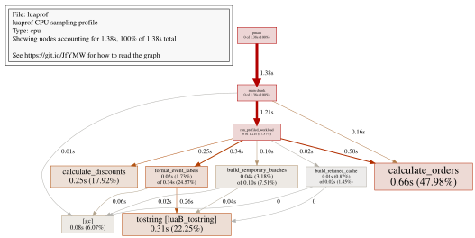
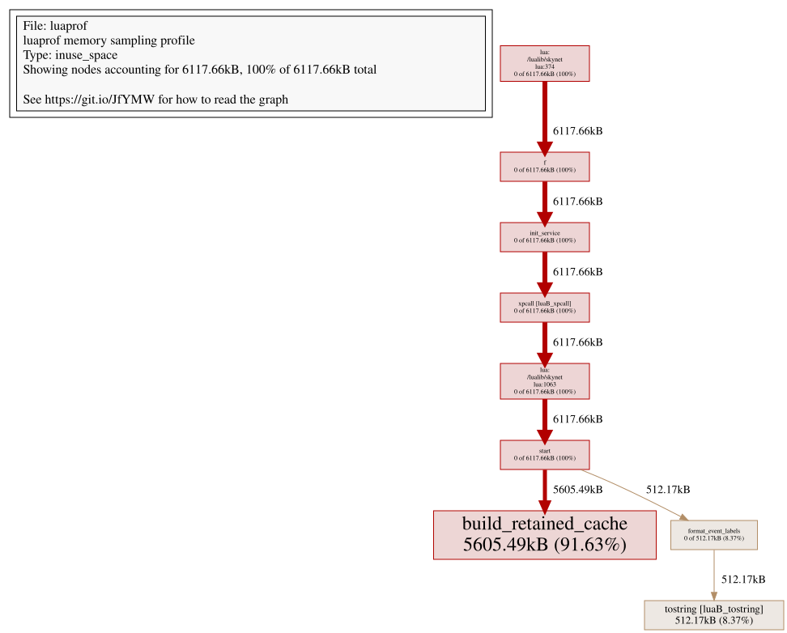

# luaprof

`luaprof` 是面向 Lua 的 Linux sampling profiler。CPU 与 memory recorder 相互独立，
结果输出为标准 pprof profile，可以直接使用 `go tool pprof` 分析，也可从已保存的
`.pb.gz` 直接生成静态 SVG 火焰图。

- **CPU**：按线程 CPU time 采样，归因到 Lua 函数、Lua 调用的 CFunction 与 GC。
- **Memory**：按分配字节随机采样，同时提供 `alloc_*` 与可选的 `inuse_*` 统计。
- **Host**：支持 thread-per-VM，也支持跟随 service 跨 worker 迁移的 Skynet。

`luaprof` 需要在 Lua VM 内加入少量 bridge 代码，用于发布 VM 状态、在安全点
采集调用栈和捕获内存分配事件。仓库提供 Lua 5.4.6、Lua 5.4.8、Lua 5.5.0 和
Skynet 的固定集成版本；使用其他 Lua 5.4/5.5 版本或定制 Skynet 时，可按
[已提交的移植 patch](patches/README.md)和[接入指南](docs/integration.md)，结合自己的
VM 改动完成移植和验证。

## 快速开始

```sh
git clone https://github.com/antsmallant/luaprof.git
cd luaprof
make
make test
```

项目接入与 recorder API 见[接入指南](docs/integration.md)和
[采样模型与结果解读](docs/profiling-model.md)。

## 效果展示

以下结果来自仓库示例；sampling 数值会随机器和每次运行略有变化。
CPU 示例使用默认的 100Hz。更高频率不一定更准确；固定周期锁相风险及多频率复测方法见
[采样模型与结果解读](docs/profiling-model.md#21-频率选择与周期锁相)。

### Thread-per-VM CPU

生成 profile 并查看热点：

```sh
make example-thread-vm
go tool pprof -top build/thread-vm-cpu.pb.gz
```

```text
File: luaprof
luaprof CPU sampling profile
Type: cpu
Showing nodes accounting for 1.37s, 100% of 1.37s total
      flat  flat%   sum%        cum   cum%
     0.67s 48.91% 48.91%      0.67s 48.91%  calculate_orders
     0.28s 20.44% 69.34%      0.28s 20.44%  tostring [luaB_tostring]
     0.24s 17.52% 86.86%      0.24s 17.52%  calculate_discounts
     0.08s  5.84% 92.70%      0.08s  5.84%  [gc]
     0.05s  3.65% 96.35%      0.33s 24.09%  format_event_labels
     0.04s  2.92% 99.27%      0.10s  7.30%  build_temporary_batches
     0.01s  0.73%   100%      0.02s  1.46%  build_retained_cache
```

独立查看交互图时可使用 `go tool pprof -svg`。GitHub 不执行其中的
SVGPan 脚本，因此 README 使用同一份 pprof DOT graph 生成静态 SVG：

```sh
go tool pprof -dot -output=build/thread-vm-cpu.dot \
  build/thread-vm-cpu.pb.gz
dot -Tsvg -o docs/images/thread-vm-cpu.svg build/thread-vm-cpu.dot
```



### Skynet Memory

生成 profile 并查看停止时仍存活的 sampled allocation：

```sh
make example-skynet
go tool pprof -sample_index=inuse_space -top build/skynet-heap.pb.gz
```

```text
File: luaprof
luaprof memory sampling profile
Type: inuse_space
Showing nodes accounting for 6117.66kB, 100% of 6117.66kB total
      flat  flat%   sum%        cum   cum%
 5605.49kB 91.63% 91.63%  5605.49kB 91.63%  build_retained_cache
  512.17kB  8.37%   100%   512.17kB  8.37%  tostring [luaB_tostring]
         0     0%   100%  6117.66kB   100%  f
         0     0%   100%   512.17kB  8.37%  format_event_labels
         0     0%   100%  6117.66kB   100%  init_service
         0     0%   100%  6117.66kB   100%  lua:./lualib/skynet.lua:1063
         0     0%   100%  6117.66kB   100%  start
```

生成适合 GitHub 预览的静态调用图：

```sh
go tool pprof -sample_index=inuse_space -dot \
  -output=build/skynet-memory-inuse.dot build/skynet-heap.pb.gz
dot -Tsvg -o docs/images/skynet-memory-inuse.svg \
  build/skynet-memory-inuse.dot
```



## 文档

- [项目接入指南](docs/integration.md)
- [可直接应用的移植 patch](patches/README.md)
- [采样模型与结果解读](docs/profiling-model.md)
- [维护者指南](docs/maintainer-guide.md)

## 许可证

[MIT License](LICENSE)
